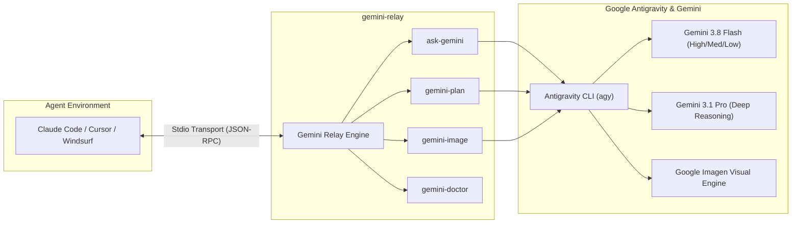

# Gemini Relay

**A high-performance Model Context Protocol (MCP) server connecting Claude Code and autonomous AI agents directly to Google Gemini 3.8 Flash, Gemini 3.1 Pro, and Google Imagen via the Antigravity CLI (`agy`).**

---

## ⚡ Overview

When pair programming with AI assistants like **Claude Code**, Cursor, or Windsurf, your local context window is your most constrained resource. **Gemini Relay** empowers your agents to offload massive file analyses, multi-million token codebases, complex architectural planning, and multimodal image creation to Google's Gemini models without polluting the agent's active context.



---

## ✨ Core Capabilities

- **🚀 Gemini 3.8 Flash by Default**: Ultra-fast responses with Google's flagship multimodal intelligence (`gemini-3.8-flash-high`).
- **🧠 Granular Reasoning Effort**: Control thinking token depth on demand using `effort: "low" | "medium" | "high"`.
- **🏗️ Architectural Blueprinting (`gemini-plan`)**: Dedicated planner running in `--mode plan` with deep thinking tokens for risk analysis, dependency mapping, and step-by-step roadmaps before writing code.
- **🎨 Multimodal Image Generation (`gemini-image`)**: Generate visual assets directly from text prompts, choose aspect ratios, and automatically export images into your project directory.
- **📐 Guaranteed Structured Outputs (`jsonSchema`)**: Enforce valid, machine-parseable JSON responses adhering to any provided JSON schema.
- **📂 Zero-Overhead Context Inlining**: Use `@src/file.ts` or `@.` syntax to send large project contexts directly into Gemini, keeping your agent's primary context lean and focused.
- **🩺 Diagnostic Self-Healing (`gemini-doctor`)**: Built-in environment inspector verifying CLI installation paths, auth status, versions, and system readiness.
- **🪟 Native Windows Performance**: Direct binary spawning of `agy.exe` avoiding `cmd.exe` multiline prompt corruption and command-length bottlenecks.

---

## 🚀 Quick Start

### Claude Code

Add the server directly to Claude Code with one command:

```bash
claude mcp add gemini-relay -- npx -y gemini-relay
```

*(On Windows PowerShell / CMD, use `claude mcp add gemini-relay -- npx -- y gemini-relay` if needed).*

Verify installation in Claude Code:
```bash
/mcp
```

### Claude Desktop

Add to your `claude_desktop_config.json`:

```json
{
  "mcpServers": {
    "gemini-relay": {
      "command": "npx",
      "args": ["-y", "gemini-relay"]
    }
  }
}
```

### Cursor & Windsurf

In Cursor or Windsurf MCP settings, add a new server:
- **Name**: `gemini-relay`
- **Type**: `command`
- **Command**: `npx -y gemini-relay`

---

## 🧰 Available MCP Tools

### 1. `ask-gemini`
Primary intelligence endpoint for general analysis, deep code review, and question answering.
- `prompt` (*string*, required): Your task or question. Supports `@path/to/file` syntax to inline local workspace files.
- `model` (*string*, optional): Gemini model (default: `gemini-3.8-flash-high`). Also accepts `gemini-3.1-pro-high`, or aliases `flash`, `pro`.
- `effort` (*"low" | "medium" | "high"*, optional): Thinking token depth.
- `mode` (*"plan" | "accept-edits"*, optional): Agent execution mode.
- `jsonSchema` (*object | string*, optional): Enforces structured JSON output matching this schema.
- `includeUsage` (*boolean*, optional): Returns token metrics (thinking tokens, input/output tokens) and latency.
- `changeMode` (*boolean*, optional): Outputs structured `<<<< OLD / NEW >>>>` diff blocks for multi-file edits.

### 2. `gemini-plan`
Non-destructive architectural blueprint generator.
- `task` (*string*, required): Feature, refactor, or architecture to design.
- `context` (*string*, optional): Constraints, references (`@file`), or requirements.
- `effort` (*"low" | "medium" | "high"*, default `"high"`): Maximum reasoning depth for comprehensive planning.
- `includeUsage` (*boolean*, default `true`): Appends token and timing metrics.

### 3. `gemini-image`
Generates high-definition imagery and assets using Google Imagen & Gemini.
- `prompt` (*string*, required): Visual description of the image to generate.
- `aspectRatio` (*enum*, optional): `"1:1"` *(default)*, `"16:9"`, `"9:16"`, `"4:3"`, `"3:4"`, `"3:2"`, `"2:3"`.
- `outputPath` (*string*, optional): Relative workspace path to save the generated image (e.g., `assets/hero.png`).

### 4. `gemini-models`
Inspects active backend information, reasoning tiers, and all available models.

### 5. `gemini-doctor`
Diagnoses your environment, verifying CLI binaries (`agy` / `gemini`), versions, and system readiness.

### 6. `brainstorm`
Structured creative ideation using established methodologies (SCAMPER, Design Thinking, Lateral Thinking, Divergent/Convergent).

---

## 💡 Practical Agent Recipes

### Analyze Codebases Without Consuming Context
```text
Ask Claude Code:
"Use ask-gemini to inspect @src/backends/agy.ts @src/constants.ts for concurrency safety and memory leaks"
```

### Create Architectural Roadmaps
```text
Ask Claude Code:
"Use gemini-plan to design an event-driven plugin system with backpressure handling"
```

### Generate Project Assets
```text
Ask Claude Code:
"Use gemini-image to create a 16:9 minimalist dark-mode cloud architecture illustration and save it to assets/hero.png"
```

---

## ⚙️ Environment Configuration

| Variable | Default | Description |
| :--- | :--- | :--- |
| `GEMINI_MCP_BACKEND` | `agy` | Active engine backend: `agy` (Antigravity CLI, recommended) or `gemini` (legacy). |
| `AGY_CLI_PATH` | auto-detected | Custom path to the `agy` binary (`agy.exe` on Windows, `/usr/local/bin/agy` on Unix). |
| `GEMINI_CLI_PATH` | auto-detected | Custom path to legacy `gemini` CLI executable. |
| `GEMINI_MCP_TIMEOUT` | `45` | Process execution timeout in minutes. |
| `AGY_PRINT_TIMEOUT` | `44m` | Timeout forwarded to `agy --print-timeout`. |

---

## 🛠️ Verification & Testing

```bash
# Run system doctor
npm run doctor

# Run full test suite (110 tests across unit, integration, and e2e)
npm test

# Type-check TypeScript codebase
npm run lint

# Build production bundle
npm run build
```

---

## 📄 License

MIT License. Copyright (c) 2026 V-Songbird.
