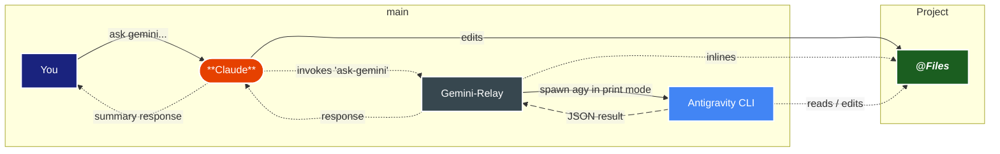

# How It Works

You ask in plain language. Your agent picks a tool, the relay runs the Antigravity CLI (`agy`) in print mode, and only the answer comes back.

This page follows one call the whole way: which backend runs, what the relay does to your prompt before it leaves, what happens when a step fails, and the three deadlines that can cut a run short.

<div align="center">⇣ when ask-gemini gets called ↴</div>
<DiagramModal>


</DiagramModal>

## Which backend runs

`GEMINI_MCP_BACKEND` decides. `agy` (or `antigravity`) selects the Antigravity CLI; `gemini` selects the legacy Gemini CLI.

Leave it unset and the choice is made against the calendar: the Gemini CLI until it retired on **2026-06-18**, `agy` from then on, because once gemini is gone agy is the only live option. The auto-flip announces itself once per process, as a `⚠️` notice on the first reply that carries notices.

## The execution path

Everything below happens inside one `ask-gemini`, `gemini-plan` or `brainstorm` call on the agy backend.

Runs are serialized behind a single promise queue. Each run rewrites agy's `last_conversations.json`, so concurrent runs would read each other's conversation ids back.

1. **The call arrives over stdio.** The MCP client invokes the tool. The relay validates the arguments against the tool's Zod schema.
2. **The prompt is built.** With `changeMode: true` the request is first wrapped in the instruction template that asks the model for `**FILE: path:line**` blocks holding an `OLD:` and a `NEW:` section. Then the relay inlines the `@` references itself, because agy does not reliably inline them. That is also where the project-root jail is enforced — see [Context Inlining](/concepts/file-analysis).
3. **Capabilities are probed.** Once per process the relay runs `agy --help` and reads which flags this build advertises. A `--help` that is missing, unparseable or too slow is not fatal: every capability simply stays false.
4. **The argument list is assembled.** One rule covers every flag: it is sent only when the probe found it advertised in `agy --help`. If the probe found nothing, no flags at all are sent and the run falls back to agy's own defaults — an unknown flag would make agy exit non-zero and fail the whole request.
5. **agy is spawned in print mode.** On a build that advertises stream-json input the prompt travels on stdin, which is why a large inlined `@file` prompt is no longer bounded by the OS argv cap. An older build keeps `-p <prompt>`.
6. **The reply is read out of the JSON result.** The relay takes the answer text, the conversation id, and — as `⚠️` notices — any status other than success and any tool call the headless run had denied. Only `ask-gemini` reports the id back to you, and only on a plain-text reply, as a trailing `🧵 conversationId: …` line.
7. **agy's own error text is surfaced verbatim.** A bad model id, an exhausted quota or a dropped login comes back in agy's words, rather than flattened into "Command failed with exit code 1".

<details>
<summary><strong>For AI agents — the probe, the argv, the result object and the transcript scrape</strong></summary>

**The probe.** `agy --help` runs once per process on a 4 s budget; a failure is non-fatal. The text is scanned for `--output-format`, `--input-format stream-json`, `--model`, `--effort`, `--json-schema`, `--mode`, `--add-dir`, `--conversation`, `--continue`, `--print-timeout`, `--sandbox`, `--dangerously-skip-permissions`, `--disable-slash-commands` and `--agent`. Every capability defaults to false, so a missing, unparseable or timed-out `agy --help` yields an all-false capability set rather than a guess.

**The argv.** `buildAgyArgs` takes the capability set as a required argument, so no caller can opt out of the gate above. Decided there: `--model` (aliases normalized first — `flash` → `gemini-3.8-flash-high`, `pro` → `gemini-3.1-pro-high`), `--effort`, `--json-schema`, `--mode`, one `--add-dir` per entry, `--agent`, `--disable-slash-commands` (added unless the caller passed `allowSlashCommands: true`), `--conversation`, `--sandbox` and `--dangerously-skip-permissions` (from `skipPermissions: true`). `--input-format`, `--output-format` and `--print-timeout` are gated by the same rule but decided in `run`, at step 5.

**Prompt delivery.** When the build advertises stream-json input the relay adds `--input-format stream-json --output-format stream-json` and writes the prompt to stdin as one NDJSON line:

```json
{"event":"user","message":{"role":"user","content":"…"}}
```

One prompt is exempt whatever the build advertises: a slash command let through by `allowSlashCommands: true` goes on argv with `-p`, because agy answers it in the CLI itself and refuses to under `--input-format stream-json`.

A build without stream-json input keeps `-p <prompt>`, with `--output-format json` when *that* is advertised and plain text when it is not. `--print-timeout` is added when the build advertises it, derived to sit under the wrapper's own deadline so agy can report its own timeout with a usable message — see [Timeouts](#timeouts).

**The result object.** Under stream-json the reply is the last `{"event":"result","result":{…}}` line; under plain `--output-format json` it is the whole of stdout. From that object the relay takes the reply text, the `conversation_id`, and — as `⚠️` notices — any `status` other than `SUCCESS` and any `denied_actions` the headless run collected. The id reaches you only from `ask-gemini`, and only on a plain-text reply: it is suppressed when `jsonSchema` is set and never reached under `changeMode`, because both bodies are parsed, and `gemini-plan` and `brainstorm` never report one at all.

**Errors.** A bad model id, an exhausted quota or a dropped login arrives as `error` in that result — on a failed exit and on an exit-0 run with `status: ERROR` alike — and is thrown as-is.

**The transcript scrape** (fallback 2 below). The transcript lives under `~/.gemini/antigravity-cli`. The conversation is the explicit `conversationId`, else this working directory's entry in `cache/last_conversations.json`, else the newest conversation written since this run started. JSONL is preferred; the dual-written SQLite file is a last resort and needs `node:sqlite` (Node 22.5+).

</details>

## Fallbacks

Steps 5 and 6 are the clean path on a current agy. Older builds lack those flags, so two older paths remain below them, and each is used only when the one above produced nothing.

1. **PTY recovery** (opt-in, `AGY_MCP_PTY=1`, POSIX only): a build that prints only to a TTY is re-run under `script(1)`. It is skipped when the prompt went on stdin, because the prompt is not in the argument list then. It runs under its own 10-minute cap, not the wrapper's — see [Timeouts](#timeouts).
2. **Transcript scrape**: the reply is read out of agy's own transcript on disk. Only a transcript written during this run is accepted, so a dropped login never surfaces a stale reply from an earlier conversation.

If none of them yields text, the run fails. Whenever print mode itself failed — the usual reason the ladder came back empty — you get agy's own error, rethrown verbatim.

Only a truly silent run gets the relay's own message instead: exit 0, no stdout, no stderr, no transcript.

```text
agy produced no output for <cwd> (no stdout, stderr, or transcript)
```

It comes with a suggestion to run `agy -p "hi"` directly, to check for an expired login or an exhausted quota.

## Timeouts

Three separate deadlines exist, and only two of them are related.

**`GEMINI_MCP_TIMEOUT`** sets the wrapper's own deadline in **minutes**, default 45. Any finite value greater than zero is accepted, fractions included — `0.5` is thirty seconds; only a non-numeric or non-positive value falls back to the default. It is read once when the server process starts, so changing it in your client's `env` block takes effect on the next restart, not the next call.

**agy's `--print-timeout`** is derived from that deadline and must stay strictly under it, or the wrapper would kill agy before agy could report its own timeout with a usable message. It is one minute less than the wrapper deadline, or half of it when the deadline is two minutes or shorter: `2640s` at the 45-minute default, `15s` at `GEMINI_MCP_TIMEOUT=0.5`. `AGY_PRINT_TIMEOUT` overrides the derived value with a Go duration string (`90s`, `10m`).

**The PTY recovery path** has its own independent cap of 10 minutes, unaffected by either of the above. On expiry it SIGKILLs the whole `script(1)` process group and returns whatever the run had already printed, which is then used as the reply — so a timed-out PTY run that printed anything comes back truncated rather than failing. The ladder continues to transcript recovery only when that partial capture yields no usable text.

While a run is in flight, clients that requested a progress token get a `notifications/progress` message every 25 seconds, so the call is not taken for stalled.
