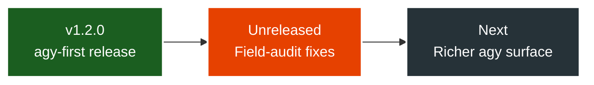
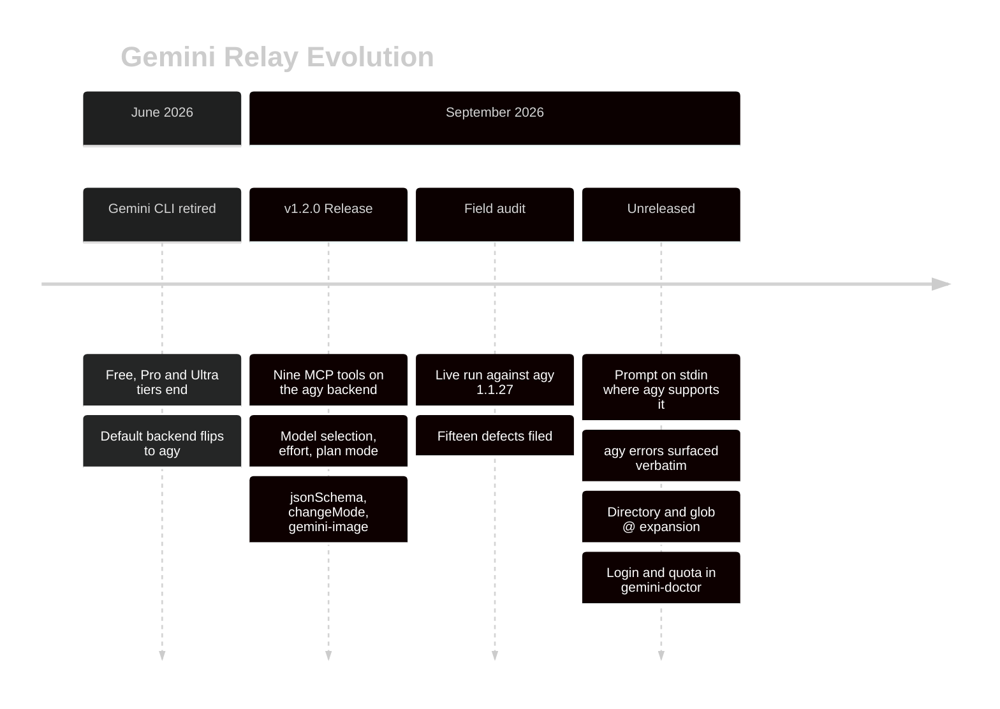

# Roadmap

Gemini Relay is at **v1.2.0**: an MCP server that drives the Antigravity CLI (`agy`) in print
mode, with the legacy Gemini CLI still selectable via `GEMINI_MCP_BACKEND=gemini`. What
follows is where the project stands and where it is going — not a release schedule.

## Evolution

<DiagramModal>

</DiagramModal>

## Timeline

<DiagramModal>

</DiagramModal>

## Shipped in v1.2.0 — 2026-09-03

- Nine MCP tools: `ask-gemini`, `gemini-plan`, `gemini-image`, `gemini-models`,
  `gemini-doctor`, `brainstorm`, `fetch-chunk`, `ping`, `Help`.
- `agy` as the primary engine, with capability detection from `agy --help` so the backend
  adapts to whatever build is installed rather than assuming a version.
- Model selection across the Gemini 3.8 / 3.7 / 3.6 Flash and 3.1 Pro families, reasoning
  `effort`, execution `mode`, and `jsonSchema`-enforced structured output.
- The project-root jail for every `@file` reference (CVE-2026-0755), symlinks included.

## In the working tree, not yet released

Each of these came out of a live field audit against `agy` 1.1.27:

- **No command-line length limit, on a build that advertises `--input-format`.** There the
  prompt reaches agy on stdin as one stream-json NDJSON message, so a large `@file` prompt no
  longer dies with `spawn ENAMETOOLONG`. Builds without it — including one whose `agy --help`
  probe timed out — keep the old `-p <prompt>` path and its argv cap.
- **agy's own error text.** A failed run reports what agy said — invalid model selection,
  exhausted quota, dropped login — instead of `Command failed with exit code 1: Unknown error`.
- **`@` means "something that exists".** Files, directories (`@.` included) and globs expand;
  everything else stays verbatim. `node_modules`, `.git`, `dist` and secret-looking files are
  skipped during directory and glob expansion — those two skips do not apply to a file you
  name directly, though a binary, an unreadable file or one past the budget is still dropped
  — under a 256 KB per-file and 2 MB per-prompt budget that names what it left out.
- **The conversation id comes back.** A plain-text `ask-gemini` reply ends with the id of the
  conversation it created or continued whenever agy reported one, so a follow-up needs no
  digging in agy's cache. A
  `jsonSchema` or `changeMode` reply omits it, because that body is parsed; `gemini-plan` and
  `brainstorm` never report one.
- **Login and quota in `gemini-doctor`.** It now runs the free, zero-token
  `agy -p "/usage" --output-format json` and reports each bucket's remaining fraction and
  reset time, rather than declaring "System Ready" over a signed-out account.
- **Slash prompts are off by default, on a build that advertises `--disable-slash-commands`.**
  There the flag is sent unless a caller passes `allowSlashCommands: true`, so a prompt
  beginning with `/` reaches the model. A build without the flag — including one whose
  `agy --help` probe timed out — expands the `/` prompt as before.
- **Refused tool calls are visible.** A run that exits successfully but reports
  `denied_actions` says so in a notice, instead of an edit appearing to have happened.
- **The retirement notice fires once per process**, not on every reply from every tool.
- **Prompt bodies stay out of the logs.** The argv handed to agy is logged as its shape —
  flags survive, every value becomes its length — and no argv is retained between calls. A tool
  call is logged as its name plus its arguments, with every **string** value reduced to
  `<N chars>` and every other value — a boolean, a number, `addDirs`, a `jsonSchema` object —
  printed in full, so neither the prompt nor the files inlined into it reach client log files.
- **New parameters surfaced from agy**: `agent` (a custom `agent.md` persona), `skipPermissions`,
  and `size` on `gemini-image`.
- **Node floor raised to 18.19.0**, matching what the test runner actually needs; CI covers
  18.x, 20.x and 22.x.

## Direction

Known gaps, roughly in the order they are worth closing:

1. **Real progress instead of canned messages.** `--output-format stream-json` emits typed
   `step_update` events with text deltas and tool calls; the relay currently reports a rotating
   set of status lines every 25 seconds.
2. **Concurrency.** Runs are serialized behind one queue because each rewrites agy's
   conversation cache. Reading the conversation id from the result object makes that queue —
   and the transcript-scraping fallback behind it — removable.
3. **Attachments.** agy accepts images, audio and video as inputs; the relay has no attachment
   parameter, so only text files ride along as `@file`.
4. **Re-test `--sandbox`.** The relay reports that it cannot guarantee isolation on the agy
   backend. That notice predates agy 1.1.5, and headless runs have honoured permission
   settings since; the claim deserves re-measuring rather than repeating.
5. **Capability cache lifetime.** `agy --help` is probed once per server process, so an agy
   that self-updates underneath a long-running server is driven with stale assumptions.

Have a different priority? Open an [issue](https://github.com/V-Songbird/gemini-relay/issues)
or start a [discussion](https://github.com/V-Songbird/gemini-relay/discussions).
